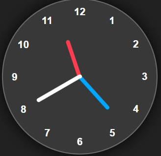

# Analog Clock

A responsive Analog Clock built using HTML, CSS, and JavaScript. It displays the current time with real-time hour, minute, and second hands.

## Technologies Used

- HTML
- CSS
- JavaScript

## Features

- Real-Time Clock
- Hour Hand
- Minute Hand
- Second Hand
- Responsive Design

## Preview

## Author

Saurav Zinjan
